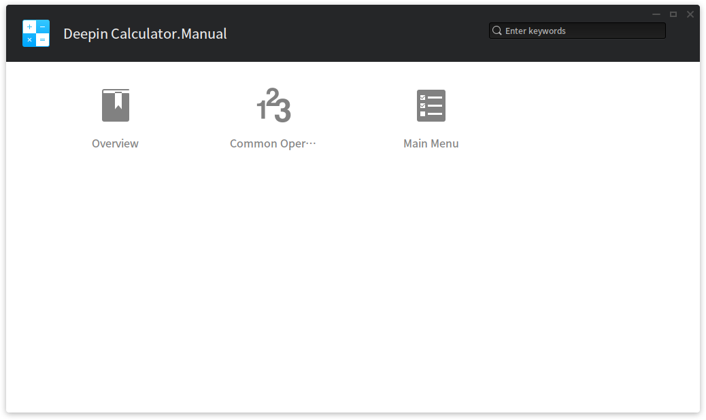
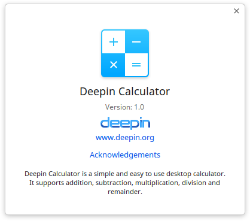

# Deepin Calculator|../common/deepin-calculator.svg|

## Overview|../common/icon_overview.svg|

Deepin Calculator is a simple and easy to use desktop calculator. It supports addition, subtraction, multiplication and division with keyboard input perfectly matched, as well as symbolic fault-tolerant computing.

## Common Operations|../common/icon_commoncoperat.svg|

### Symbol Introduction

<table class="block1">
    <caption></caption>
    <tbody>
        <tr>
            <td>0~9</td>
            <td>Number Key</td>
            <td>Basic arabic numerals</td>
        </tr>
        <tr>
            <td>c</td>
            <td>Clear</td>
            <td>One click to clear current contents, double click to clear all.</td>
        </tr>
    	<tr>
            <td>%</td>
            <td>Percent sign</td>
            <td>To input percent sign</td>
        </tr>
    	<tr>
            <td></td>
            <td>Delete</td>
            <td>One click to delete a character</td>
        </tr>
    	<tr>
            <td>+-×÷</td>
            <td>Addition, subtraction, multiplication, and division</td>
            <td>Basic math operator.</td>
        </tr>
        <tr>
            <td>.</td>
            <td>Decimal Point</td>
            <td>To input decimal point.</td>
        </tr>
        <tr>
            <td>()</td>
            <td>Bracket</td>
            <td>To input bracket and auto complete left and right bracket.</td>
        </tr>
        <tr>
            <td>=</td>
            <td>Equal Sign</td>
            <td>To get result</td>
        </tr>
    </tbody>
</table>

> : You can select the current line by mouse to edit and copy.

### Symbolic Fault-tolerant Computing

Deepin Calculator supports keyboard operation and fault-tolerant computing of special symbols besides normal numbers and operation symbols.

- Fault-tolerance processing of multiplication: Input asterisk (*) and letter x to trigger multiplication;
- Fault-tolerance processing of subtraction: Input minus (-) and underline (_) to trigger subtraction;
- Fault-tolerance processing of bracket symbol: Input open and close brackets to trigger bracket;
- Fault-tolerance processing of equal sign: Input = in English and Chinese to trigger equal sign;
- Fault-tolerance processing of clear symbol: Press Esc to trigger clearing;
- Fault-tolerance processing of delete symbol: Press Backspace  to trigger deleting;

## Main Menu|../common/icon_optionsetting.svg|

### Switch Theme

The theme of Deepin Calculator is light by default, you can click on **Dark Theme** to swith.

1. On Deepin Calculator interface, click on .
2. Select **Dark Theme**.
3. The interface will switch to dark theme.

### Help

1. On Deepin Calculator interface, click on .
2. Select **Help**.
3. View the manual.

### About

1. On Deepin Calculator interface, click on .
2. Select **About**.
3. View the version description.

### Exit

1. On Deepin Calculator interface, click on .
2. Click on **Exit** to exit.
