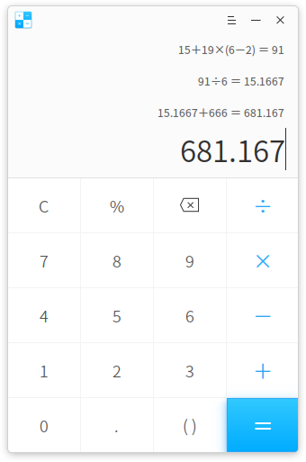
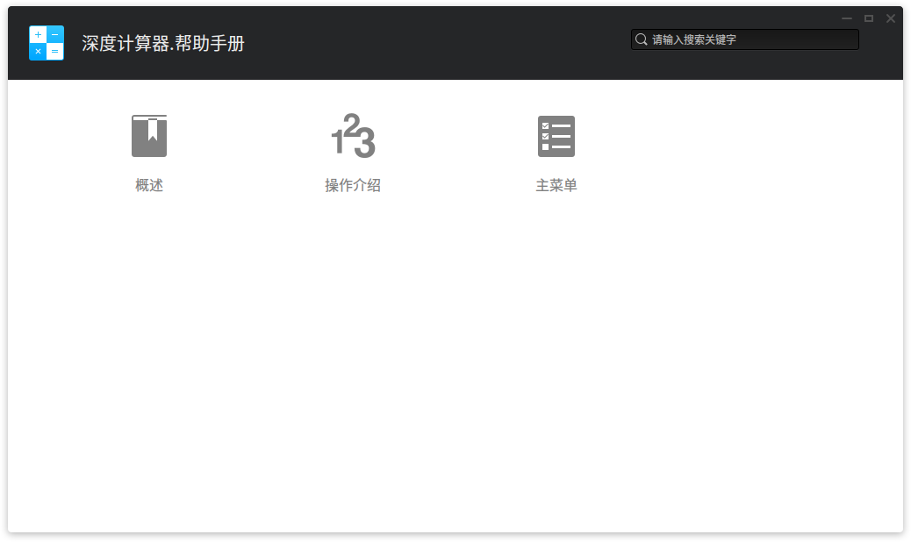

# 深度计算器|../common/deepin-calculator.svg|

## 概述|../common/icon_overview.svg|

深度计算器是一款简单易用的桌面计算器，支持加减乘除运算。完美支持键盘输入，在键盘输入时还支持符号容错，最多可以显示三行计算结果。

## 操作介绍|../common/icon_commoncoperat.svg|

### 界面符号介绍

<table class="block1">
    <caption></caption>
    <tbody>
        <tr>
            <td>0~9</td>
            <td>数字键</td>
            <td>基本阿拉伯数字。</td>
        </tr>
        <tr>
            <td>c</td>
            <td>清除</td>
            <td>点击一次清除当前的表达式内容，连续按两次清空所有表达式历史。</td>
        </tr>
    	<tr>
            <td>%</td>
            <td>百分号</td>
            <td>用来输入百分号。</td>
        </tr>
    	<tr>
            <td></td>
            <td>删除</td>
            <td>点击一次向前删除一个字符。</td>
        </tr>
    	<tr>
            <td>+-×÷</td>
            <td>加减乘除</td>
            <td>基本数学运算符，用来进行加法、减法、乘法、除法运算。</td>
        </tr>
        <tr>
            <td>.</td>
            <td>小数点</td>
            <td>用来输入小数点。</td>
        </tr>
        <tr>
            <td>()</td>
            <td>括号</td>
            <td>用来输入括号，左右括号自动补全。</td>
        </tr>
        <tr>
            <td>=</td>
            <td>等于</td>
            <td>用来得出计算结果。</td>
        </tr>
    </tbody>
</table>

> :您可以使用鼠标选择当前输入行，进行修改或复制操作。

### 数学符号容错

深度计算器支持键盘操作，除了常规的数字和运算符支持之外，还支持数学符号容错功能，让你在键盘输入表达式时，键盘的中英文状态和大小写状态，都不会影响输入表达式。

另外还支持一些特殊的符号容错：

- 乘法符号容错处理：用户输入 * (星号）、x (字母x)都会触发乘法符号激活；
- 减法符号容错处理：输入 - (减号）、_ (下划线）都会触发减法符号激活；
- 括号符号容错处理：输入 左圆括号、右圆括号都会触发括号符号激活；
- 清除符号容错处理：输入 Esc 符号触发清除符号激活；
- 删除符号容错处理：输入 Backspace 符号触发删除符号激活；

## 主菜单|../common/icon_optionsetting.svg|

### 切换主题

您可以点击帮助获取深度计算器的帮助手册，通过帮助进一步让您了解和使用深度计算器。

1. 在深度计算器界面，点击 。
2. 点击 **深色主题/浅色主题**，来切换主题颜色。

### 帮助

您可以点击帮助获取深度计算器的帮助手册，通过帮助进一步让您了解和使用深度计算器。

1. 在深度计算器界面，点击 。
2. 点击 **帮助**。
3. 查看关于深度计算器的帮助手册。

### 关于

您可以点击关于查看深度计算器的版本介绍。

1. 在深度计算器界面，点击 。
2. 点击 **关于**。
3. 查看关于深度计算器的版本和介绍。

### 退出

您可以进入菜单栏点击退出深度计算器。

1. 在深度计算器界面，点击 。
2. 点击 **退出**。

