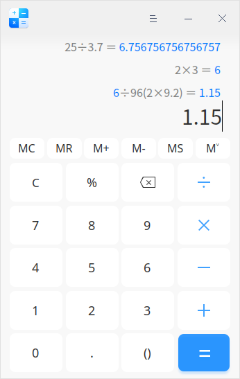
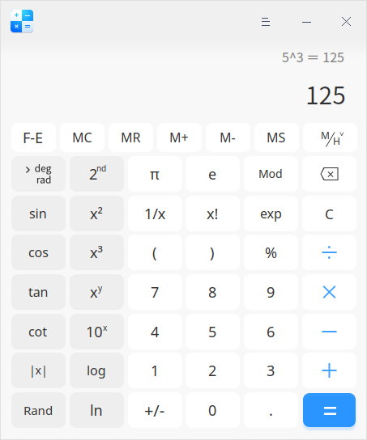
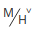
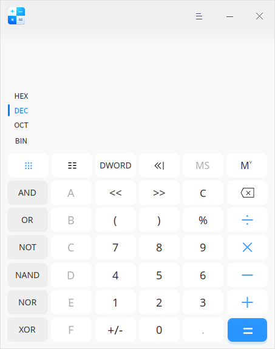
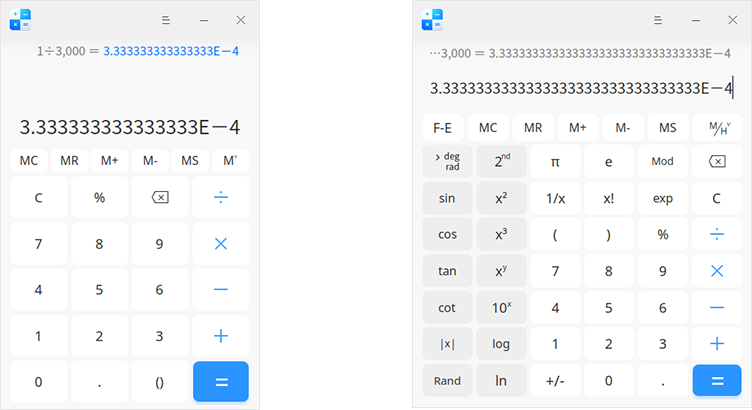

<!--
SPDX-FileCopyrightText: 2022 UnionTech Software Technology Co., Ltd.

SPDX-License-Identifier: GPL-3.0-or-later
-->

# Calculator|deepin-calculator|

## Overview

Calculator is a simple and easy-to-use desktop calculator. It supports standard mode, scientific mode and programmer mode, with keyboard input perfectly matched, as well as symbolic fault-tolerant computing and calculation result linkage.

## Modes

Click  > **Mode** to:

- Select **Standard**  to perform the four fundamental operations of arithmetic;
- Select **Scientific** to perform high-level operations such as function, exponent, root, and so on. 
- Select **Programmer** to perform binary, octal, decimal, hexadecimal and other complex operations.

### Standard Mode

​                            

| Icon                            | Name                                                | Description                                                  |
| ------------------------------- | :-------------------------------------------------- | ------------------------------------------------------------ |
| 0~9                             | Number Key                                          | Basic Arabic numerals                                        |
| MC                              | Clear Key                                           | Clear all memories                                           |
| MR                              | Storage Key                                         | Memory recall                                                |
| M+                              | Storage Key                                         | Memory add; click it to add the current number accumulatively to the memory and interrupt digital input. |
| M-                              | Storage Key                                         | Memory subtract; click it to subtract the current number from the memory and interrupt digital input. |
| MS                              | Storage Key                                         | Memory store；click it to add the numeric value in the input box to the memory list. |
|            | Storage Key                                         | Click to expand the memory list; click again to fold the memory list. The memory will be cleared up when Calculator is closed. |
| C/AC                            | Clear                                               | Click once to clear current contents and click twice to clear all. |
| %                               | Percent Sign                                        | To input percent sign                                        |
|  | Delete                                              | Click once to delete a character forward                     |
| +-×÷                            | Addition, subtraction, multiplication, and division | Basic math operators for addition, subtraction, multiplication and division |
| .                               | Decimal Point                                       | To input decimal point                                       |
| ()                              | Bracket                                             | To input brackets with the left and right bracket completed automatically. |
| =                               | Equal Sign                                          | To get result                                                |

### Scientific Mode

| Icon                                                         | Name       | Description                                                         |
| ------------------------------------------------------------ | :--------- | ------------------------------------------------------------ |
| F-E                                                          | E-notation   | Click F-E to startup E-notation. Click again to close E-notation. |
|  | Storage key   | Click this button to show the memory list and history. |
| // | Metric conversions   | Click this button to calculate the angle, gradient and radian respectively. |
| sin, cos, tan, cot                                        | Trigonometric functions | Click these buttons to calculate the sine, cosine, tangent and cotangent of the numerical value respectively. |
| sin-1, cos-1, tan-1, cot-1 | Anti-trigonometric function | Click 2nd to switch to the second function interface. Click them to calculate the anti-trigonometric functions of sin, cos, tan and cot respectively. |
| &#124;x&#124;, Rand                                         | F functions | Click these buttons to calculate the absolute value of the value and randomly display a 31 bit number. |
| 2nd                                               | 2nd function key | Click 2nd to switch to the second function interface; click again to switch to trigonometric functions and power operations. |
| x2, x3 , xy | Power function | Click this button to calculate the square, cubic, y-power of numerical values. |
|  10x, 2x, ex  | Exponential function | Click these buttons to calculate the x-power of 10, the x-power of 2 and the x-power of e respectively. 2 x  and e x  are the second function interface buttons. |
| , ,  | Power function | Click 2nd to switch to the second function interface. Click them to calculate the square root, cube root and y-th root of X respectively. |
| log, In, logyx                      | Logarithmic function | Click these buttons to calculate the logarithms based on 10 and E, respectively. logyx is the second function interface button. |
| π                                                          | PI                                      | It approximately equals to 3.14159......, which can be accurate to 31 digits after the decimal point. |
| e                                                            | Constant | It approximately equals to 2.71828....., which can be accurate to 31 digits after the decimal point. |
| Mod                                                          | Remainder | Click this button to display the modulus or remainder of x / y. |
| 1/x                                                          | Inverse proportional function | Click this button to calculate the reciprocal of the displayed value. |
| x!                                                           | Factorial | Click this button to calculate the factorial of the displayed number. |
| exp                                                          | Exponent | Click it to enter numbers in scientific notation. |

### Programmer Mode

| Icon                       | Name     | Description                                                         |
| -------------------------- | :------- | ------------------------------------------------------------ |
| HEX, DEC, OCT, BIN       | Hex | They are respectively hexadecimal, decimal, octal, and binary; in which, decimal is the default one. |
|  | Full keyboard | Click it to return to full keyboard interface. |
|  | Digit switching keyboard | Click it to show 0～63 digit bits,  clicking each bit is supported. |
| QWORD/DWORD/WORD/BYTE     | Data type | Click it to select modes, including Byte (8 bits), Word (16 bits), DWord (32 bits), and QWord (64 bits) |
| /// | Bit shifting | They are respectively arithmetic shift, logical shift, circular shift and rotate through carry circular shift. |
| AND, OR, NOT, NAND, NOR, XOR        | Logical operators | Select the logical operator you need for working with logic gates. |
| A~F       | Letters | They are only activated in hexadecimal.                      |
| <<, >>      | Movement   operators | Click them to move left or right. |

## Functions

### Use thousands / ten-thousands separator 

Calculator supports thousands / ten-thousands separator. When the expression is in thousands, you can right-click the current expression area and select **Use ten-thousands separator**. When the expression is ten thousands, right-click the current expression area and select **Use thousands separator**.

### Symbolic Fault-tolerant Computing

Calculator supports keyboard operation and fault-tolerant computing of special symbols besides normal numbers and operation symbols. The input of expressions will not be affected by the input status as well as the case state of the keyboard.

- Fault-tolerance processing of multiplication: Input asterisk (*) or letter x to trigger multiplication;
- Fault-tolerance processing of division: Input division (/)  to trigger division;
- Fault-tolerance processing of addition: Input addition (+)  to trigger addition;
- Fault-tolerance processing of subtraction: Input minus (-) or underline (_) to trigger subtraction;
- Fault-tolerance processing of percent sign: Input percent sign (%)  to trigger remainder percent sign;
- Fault-tolerance processing of decimal point: Input an English decimal point (.) or a Chinese period (。) to trigger decimal point.
- Fault-tolerance processing of the bracket symbol: Input open and close brackets to trigger bracket;
- Fault-tolerance processing of equal sign: Input **=** in English and Chinese or press the **Enter** key to trigger equal sign;
- Fault-tolerance processing of the clear symbol: Press **Esc** to trigger clearing;
- Fault-tolerance processing of the delete symbol: Press **Backspace**  to trigger deleting;
- Fault-tolerance processing of the letter symbol: Whether the keyboard is in upper or lower case, pressing the **A~F** keys will trigger the activation of letters.

### Expression

- Click  =  in the current expression input area or press the **Enter** key on the keyboard to perform calculation and display the calculated result in the current input box. The expression becomes historical expression. 
- Reedit: Click a single expression to reedit. The expression is displayed in the expression input area. After editing, press the **Enter** key or = on the keyboard or click = in the expression input area to modify the result of historical expression and linkage expression.
- Expression error: If the expression input is incorrect, it is unavailable to perform calculation and "Expression error" is displayed.

  
### Scientific Notation

When the calculation result is more than 16 digits / 32 digits respectively, it will be displayed in scientific notation, that is, taking the first 16 digits / 32 digits multiplied by 10 to the power of plus or minus n.

  - When the calculation result is an integer and greater than 16 digits / 32 digits, it is displayed in the following format: number + numbers of 15 digits / 31 digits after the decimal point+E+number.

  - When the calculation result is decimal and greater than 16 digits / 32 digits, it is displayed in the following format: number + numbers of 15 digits / 31 digits after the decimal point+E-number.

  

### Digital Linkage

- It is available to continue entering operator after an expression displays its numerical result. The first number in the expression now is the calculation result of the previous one.  Take the current expression 10 + 20 = 30 for example. The displayed result is 30.  Input + and number 9 and a new expression will be formed, 30 + 9. Press the **Enter** key and the calculation result of the new expression will be 39.
- After the two expressions are linked, modify the numbers and operators of the previous expression. If the calculation result changes, it will affect the result of the new expression linked to it. For example, the two expressions 10 + 20 = 30 and 30 + 9 = 39 are linked. If the operator +  in the first expression is changed to *, the expression will be 10 x 20 = 200. The second expression will be changed to 200 + 9 = 209 automatically. Up to 9 expression linkages are supported according to this rule.
-  In the process of re-editing an expression containing linked numbers, if the expression of linked numbers or linked numbers are modified incorrectly, the linkage can be released. 

>Notes: This function is only supported under Standard Mode.

## Main Menu

On the main menu, you can switch window themes, view help manual and get more information about Calculator.

### Theme

The window theme includes Light Theme, Dark Theme and System Theme.

1.  On the Calculator interface, click  .
2.  Click **Theme** to select a theme.

### Help

View Help to get more information about Calculator.

1.  On the Calculator interface, click .
2.  Select **Help**.
3.  View the manual.

### About

1. On the Calculator interface, click .
2. Select **About**.
3. View the version description.

### Exit

1. On the Calculator interface, click .
2. Click **Exit** to exit.
