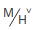

<!--
SPDX-FileCopyrightText: 2022 UnionTech Software Technology Co., Ltd.

SPDX-License-Identifier: GPL-3.0-or-later
-->

# 計數機|deepin-calculator|

## 概述

計數機是一款功能強大的桌面計算工具，支持標準模式、科學模式和程序員模式。完美支持鍵盤輸入，在鍵盤輸入時還支持符號容錯及計算結果聯動。

## 模式介紹

在計數機界面，單擊  > **模式**，您可以：

- 選擇 **標準**，切換到標準模式界面，執行基本的加減乘除運算。
- 選擇 **科學**，切換到科學模式界面，執行函數、指數、方根等高級運算。
- 選擇 **程序員**，切換到程序員模式界面，執行二進制、八進制、十進制、十六進制等複雜運算。

### 標準模式

| 圖標                       | 名稱     | 說明                                                         |
| -------------------------- | :------- | ------------------------------------------------------------ |
| 0~9                        | 數字鍵   | 基本阿拉伯數字。                                             |
|MC               | 清除鍵 | 清除所有內存。                                           |
|  MR              | 存儲鍵  |重新調用內存。 |
| M+           | 存儲鍵| 內存增加；將當前數值累加到存儲器中，中斷數字輸入。    |
|  M-   |存儲鍵  | 內存減少；從存儲器內容中減去當前顯示值，中斷數字輸入。           |
| MS              | 存儲鍵  | 內存存儲；將輸入框中的數值添加到內存列表中。                       |
|  | 存儲鍵 | 單擊展開內存列表，再次單擊摺疊內存列表；關閉應用後內存清零。 |
| C/AC                       | 清除     | 分別表示清除當前的表達式內容，清空所有歷史表達式。 |
| %                          | 百分號   | 用來輸入百分號。                                             |
|  | 刪除      | 單擊一次向前刪除1個字符。                                    |
| +-×÷                       | 加减乘除 | 基本數學運算符，用來進行加法、減法、乘法、除法運算。         |
| .                          | 小數點   | 用來輸入小數點。                                             |
| ()                         | 括號   | 用來輸入括號，單擊一次，同時顯示左右括號。如果從鍵盤輸入，輸入左括號則出現左括號， 輸入右括號則出現右括號，若只出現一側括號，則表達式計算錯誤。 |
| =                          | 等於     | 用來得出計算結果。                                           |

### 科學模式

| 圖標                       | 名稱     | 說明                                                         |
| -------------------------- | :------- | ------------------------------------------------------------ |
| F-E        | 科學計數 | 單擊 **F-E** 開啟科學計數，再次單擊關閉科學計數。 |
|   | 存儲鍵 | 展示內存列表及歷史記錄。 |
| // | 度量轉換 | 分別計算角度、梯度、弧度。 |
| sin、cos、tan、cot          | 三角函數 | 分別計算數值的正弦、餘弦、正切、餘切。                        |
| sin-1、cos-1、tan-1、cot-1 | 反三角函數 | 單擊 **2nd** 切換到第二功能界面，分別計算sin、cos、tan、cot的反三角函數。 |
| &#124;x&#124;、Rand | F函數 | 分別計算數值的絕對值和隨機顯示一個31位的小數。              |
| 2nd | 第二功能鍵 | 單擊 **2nd** 切換到第二功能界面，再次單擊返回到三角函數與次方運算界面。 |
|  x2、x3 、xy | 冪函數 | 分別計算數值的平方、立方、y次方。 |
|  10x、2x、ex  | 指數函數 | 分別計算10的x次方、2的x次方和e的x次方。其中2x和ex為第二功能界面按鈕。 |
|  、、 | 冪函數  | 單擊 **2nd** 切換到第二功能界面，分別計算數值的平方根、立方根、x的y次方根。 |
| log、In、logyx | 對數函數 | 分別以10為底的對數值、以e為底的對數值、以y為底x的對數。其中logyx 為第二功能界面按鈕。 |
| π | 圓周率 | 約等於3.14159......，可精確到小數點後31位。 |
| e              | 自然常數 | 約等於2.71828......，可精確到小數點後31位。 |
| Mod            | 求余函數 | 顯示x/y的模數或餘數。 |
| 1/x | 反比例函數 | 計算顯示數值的倒數。 |
|x! | 階乘 | 計算顯示數字的階乘。 |
|exp | 指數 | 允許輸入用科學計數法表示的數字。 |

### 程序員模式

| 圖標                       | 名稱     | 說明                                                         |
| -------------------------- | :------- | ------------------------------------------------------------ |
| HEX、DEC、OCT、BIN       | 進制 | 分別為十六進制、十進制、八進制、二進制；其中十進制為默認進制。 |
|  | 全鍵盤 | 單擊返回至全鍵盤界面。 |
|  | 位切換鍵盤 | 展示0～63位bit位，支持點擊每一位bit位。 |
| QWORD/DWORD/WORD/BYTE     | 數據類型 | 單擊按鈕選擇模式；分別為四字（64位）、雙字（32位）、字（16位）、字節（8位）。 |
| /// | 移位切換 | 分別為算術移位、邏輯移位、循環移位、帶進位循環移位。 |
| AND、OR、NOT、NAND、NOR、XOR        | 邏輯運算符 | 分別為與、或、非、與非、或非、異或。                       |
| A~F       |  字母| 僅在16進制下被啟動。                 |
| <<、>>      | 移位操作符 | 分別為左移位、右移位。 |

## 功能介紹

### 千/萬分位顯示

計算器支持千分位和萬分位數字顯示。當表達式為千分位時，您可以右鍵單擊當前表達式區域，選擇 **切換為萬分位**；當表達式為萬分位時，右鍵單擊當前表達式區域，選擇 **切換為千分位**。

### 數學符號容錯

計數機支持鍵盤操作，除了常規的數字和運算符支持之外，還支持數學符號容錯功能，讓您在鍵盤輸入表達式時，鍵盤的中英文狀態和大小寫狀態，都不會影響輸入表達式。

- 乘法符號容錯處理：輸入 * （星號）或x （字母x）都會觸發乘法符號啟動；
- 除法符號容錯處理：輸入 / 字符觸發除法符號啟動；
- 加法符號容錯處理：輸入 +（加號）會觸發加法符號啟動； 
- 減法符號容錯處理：輸入 - （減號）或_（下劃線）都會觸發減法符號啟動；
- 百分號符號容錯處理：輸入 % 字符觸發百分號啟動；
- 小數點符號容錯處理：輸入 . （英文小數點）或。（中文句號）都會觸發小數點符號啟動； 
- 括號符號容錯處理：輸入左圓括號或右圓括號都會觸發括號符號啟動；
- 等於號符號容錯處理：輸入 = （等於號）或按 **Enter** 鍵都會觸發等於號符號啟動；
- 清除符號容錯處理：按 **Esc** 鍵觸發清除符號啟動；
- 刪除符號容錯處理：按 **Backspace** 鍵觸發刪除符號啟動；
- 字母符號容錯處理：無論鍵盤上處於大寫或小寫狀態，按下 **A~F** 鍵都會觸發字母啟動。

### 表達式

- 在當前輸入表達式區域單擊 =（等號）或按下鍵盤上的 **Enter** 鍵執行計算，當前輸入框中顯示計算結果數字，表達式進入歷史表達式區域。
- 重新編輯：單擊單條歷史表達式，可重新編輯表達式，表達式顯示在輸入表達式區域 ，重新編輯後按下鍵盤上的 **Enter** 鍵或 **=** （等號），可修改歷史表達式及聯動表達式的數字結果。
- 表達式錯誤：如輸入的表達式錯誤，無法計算，則顯示表達式錯誤。

### 科學計數法

在標準模式和科學模式下，計算結果分別大於16位和32位時用科學計數法顯示，即計算結果取前 16 位/ 32 位乘以 10 的正負n次方。

- 當計算結果為整數且大於 16 位/ 32 位時，顯示數字+小數點後 15 位/ 31 位 + E + 數字。
- 當計算結果為小數且大於 16 位/ 32 位時，顯示數字+小數點後 15 位/ 31 位 + E - 數字。

### 數字聯動

- 當一個計算表達式顯示數字結果後，可以繼續輸入操作符號，此時，新表達式的第一個數就是上一個表達式的計算結果。

  例如：當前表達式是 10 + 20 = 30， 顯示計算結果 30 後，鍵入 + 號，再輸入數字9，會新建一個新的表達式為 30 + 9，按 **Enter** 鍵，得出新表達式的計算結果為39。

- 兩個表達式產生聯動後，修改上一個表達式的數字和操作符，如果其計算結果改變，則會影響與其聯動的新表達式的結果。

  例如：兩個表達式 10 + 20 = 30 和 30 + 9 = 39 產生聯動，如果將第一個表達式的操作符 + 號修改為 x 號，算式為 10 x 20 = 200 ， 則第二個表達式自動轉變為 200 + 9 = 209；根據此規則，最多可支持9條表達式聯動。

- 重新編輯含有聯動數字的表達式時，修改聯動數字或聯動數字的表達式錯誤時，聯動解除，同時會取消數字高亮顯示。

>說明：僅在標準模式下支持數字聯動。

## 主菜單

在主菜單中，您可以切換運算模式、切換窗口主題、查看幫助手冊，了解計數機的更多訊息。

### 主題

窗口主題包含淺色主題、深色主題和系統主題。

1. 在計數機界面，單擊。
2. 選擇 **主題**，選擇一個主題顏色。

### 幫助

查看幫助手冊，進一步了解和使用計數機。

1. 在計數機界面，單擊 。
2. 選擇 **幫助**。
3. 查看計數機的幫助手冊。

### 關於

1. 在計數機界面，單擊 。
2. 選擇 **關於**。
3. 查看計數機的版本和介紹。

### 退出

1. 在計數機界面，單擊 。
2. 選擇 **退出**。

